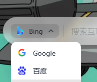

# 在新标签页功能开发清单

## ✅ 已完成功能

- [X] 实时时钟显示
- [X] 日期显示
- [X] 时间格式设置 (12/24 小时制)
- [X] 显示/隐藏秒数设置
- [X] 显示/隐藏日期设置
- [X] 多引擎搜索 (Google/百度/Bing/DuckDuckGo)
- [X] 搜索引擎图标显示
- [X] 搜索框样式设置 (不透明度/颜色/圆角)
- [X] 搜索框 hover 动效 (缩放/透明度变化)
- [X] 书签管理 (添加/删除)
- [X] 渐变背景
- [X] Unsplash 壁纸 (Picsum)
- [X] Bing 每日壁纸
- [X] Wallhaven 壁纸 (8 种分类)
- [X] 壁纸下载功能
- [X] 自定义壁纸 URL
- [X] 壁纸模糊/亮度调节
- [X] Custom CSS
- [X] 番茄钟
- [X] 待办事项
- [X] 天气显示 (模拟数据)
- [X] 每日一言
- [X] 配置导入/导出
- [X] 新设置面板 (侧边栏)
- [X] 云端同步 (Supabase)
- [X] 用户登录/注册
- [X] GitHub 账号登录
- [X] 多设备同步
- [X] 项目重命名为 Constantine's Tab
- [X] 小组件系统 (倒计时/便签/日历)
- [X] 书签编辑模式 (添加/编辑/删除)
- [X] 书签图标自动获取 (favicon)
- [X] 时钟字体大小调节

---

## 📋 待开发功能

### 🎨 外观与主题

- [ ] 深色/浅色主题切换
- [ ] 自定义主题色
- [ ] 字体设置 (大小/字体族)
- [ ] 动态粒子背景
- [ ] 毛玻璃效果强度调节

### 🔍 搜索功能

- [ ] 搜索建议/自动补全
- [ ] 搜索历史记录
- [ ] 自定义搜索引擎
- [ ] 快捷搜索命令 (如 /g 搜索 Google)

### 🔖 书签功能

- [ ] 书签分组/文件夹
- [ ] 书签拖拽排序
- [ ] 书签图标自动获取 (favicon)
- [ ] 书签搜索
- [ ] 从浏览器导入书签
- [ ] 书签访问统计

### 🌤️ 天气功能

- [ ] 接入真实天气 API
- [ ] 自动定位城市
- [ ] 多日天气预报
- [ ] 天气图标动画

### 🍅 番茄钟功能

- [ ] 番茄钟完成提示音
- [ ] 番茄钟桌面通知
- [ ] 番茄钟统计报表
- [ ] 自定义番茄钟时长

### ✅ 待办事项功能

- [ ] 待办事项分类/标签
- [ ] 待办事项截止日期
- [ ] 待办事项提醒
- [ ] 待办事项拖拽排序
- [ ] 已完成事项归档

### 📜 每日一言功能

- [ ] 接入一言 API (hitokoto)
- [ ] 诗词 API
- [ ] 自定义名言库
- [ ] 一键复制名言

### ⌨️ 快捷键

- [ ] 快捷键打开设置 (Esc)
- [ ] 快捷键聚焦搜索框 (/)
- [ ] 快捷键切换书签 (数字键)
- [ ] 自定义快捷键

### 🔄 数据同步

- [X] 云端同步 (Supabase)
- [X] 用户登录/注册
- [X] Google 账号登录
- [X] GitHub 账号登录
- [X] 多设备同步

### 🧩 小组件系统

- [ ] 可拖拽布局
- [ ] 小组件开关
- [ ] 小组件大小调整
- [ ] 倒计时小组件
- [ ] 便签小组件
- [ ] 日历小组件
- [ ] 股票/加密货币小组件

### 🌐 浏览器扩展

- [ ] Chrome 扩展打包
- [ ] Firefox 扩展打包
- [ ] Edge 扩展打包
- [ ] 扩展商店发布

### 🎬 动效与交互

- [ ] 页面加载动画
- [ ] 书签悬停动效
- [ ] 背景切换过渡动画
- [ ] 时钟翻页效果

### 🔧 其他功能

- [ ] 多语言支持 (i18n)
- [ ] PWA 支持
- [ ] 离线缓存
- [ ] 性能优化
- [ ] 无障碍支持 (a11y)

---

## 🚀 优先级建议

### 高优先级

1. 搜索建议/自动补全
2. 书签拖拽排序
3. 接入真实天气 API
4. 快捷键支持
5. 深色/浅色主题切换

### 中优先级

1. 书签分组
2. 番茄钟提示音/通知
3. 接入一言 API
4. 浏览器扩展打包

### 低优先级

1. 云端同步
2. 小组件系统
3. 多语言支持

---

## 📝 备注

在下方写下你想要优先开发的功能，我会帮你实现：

```
我想要开发的功能：
1.搜索引擎弹出来的框 需要缩小宽度到上面那个的竖线 会好看一点
2.切换搜索引擎有一个简短的动画 烟花或者星星那种
```
